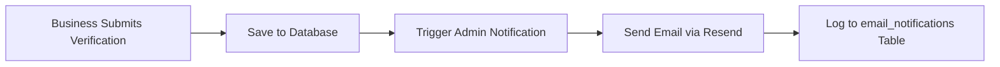
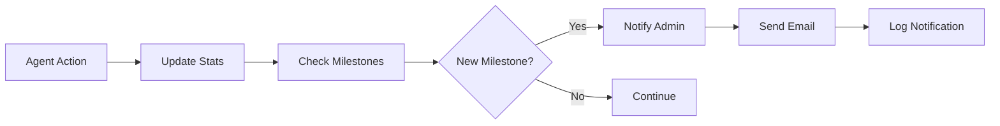

# Admin Notification System

## Overview

The admin notification system automatically alerts administrators via email when critical events occur in the Mansa Musa Marketplace platform.

## Features

### 1. Business Verification Notifications
Admins receive instant email alerts when:
- A new business submits verification documents
- Verification includes business name, owner email, and verification ID
- Direct link to admin dashboard for quick review

### 2. Sales Agent Milestone Notifications
Admins receive celebratory notifications when agents achieve:

#### Referral Milestones
- **First Referral** 🎉 - Agent's first successful referral
- **10 Referrals** 🎯 - Reached 10 total referrals
- **25 Referrals** 🌟 - Reached 25 total referrals
- **50 Referrals** 💎 - Reached 50 total referrals
- **100 Referrals** 👑 - Reached 100 total referrals

#### Earnings Milestones
- **$100 Earned** 💰 - First $100 in commissions
- **$500 Earned** 💵 - Reached $500 in earnings
- **$1,000 Earned** 🏆 - Reached $1,000 in earnings
- **$5,000 Earned** 🚀 - Reached $5,000 in earnings

#### Performance Milestones
- **50% Conversion Rate** 📈 - Achieved 50% QR scan to signup conversion
- **75% Conversion Rate** ⭐ - Achieved 75% QR scan to signup conversion

## Configuration

### Required Environment Variables

Set in your Supabase project secrets:

```bash
RESEND_API_KEY=your_resend_api_key
ADMIN_EMAIL=admin@example.com
```

### Email Service Setup

1. Sign up at [resend.com](https://resend.com)
2. Verify your email domain at https://resend.com/domains
3. Create an API key at https://resend.com/api-keys
4. Add the API key as `RESEND_API_KEY` secret
5. Set your admin email as `ADMIN_EMAIL` secret

## How It Works

### Business Verification Flow



### Milestone Detection Flow



## Integration Points

### Automatic Triggers

1. **Business Verification Submission**
   - Location: `src/lib/api/verification-api.ts`
   - Function: `submitVerificationRequest()`
   - Triggers: When business submits verification documents

2. **Agent Milestone Achievement**
   - Location: `src/components/auth/hooks/useSignupForm.ts`
   - Triggers: After successful referral signup conversion
   - Checks all milestone thresholds

3. **Manual Milestone Checks**
   - Location: `src/lib/api/milestone-tracker.ts`
   - Function: `trackAndNotifyMilestones()`
   - Can be triggered manually for any agent

## Email Templates

### Business Verification Email
- Subject: `🔔 New Business Verification: [Business Name]`
- Includes: Business details, verification ID, review link
- Action: Direct link to admin dashboard verification tab

### Milestone Email
- Subject: `[Emoji] Agent Milestone: [Agent Name] - [Milestone]`
- Includes: Agent details, milestone type, current value
- Suggestions: Recognition actions, bonus considerations
- Action: Direct link to sales agent analytics

## API Reference

### Edge Function: send-admin-notification

**Endpoint:** `/functions/v1/send-admin-notification`

**Request Body:**
```typescript
{
  type: 'business_verification_submitted' | 'agent_milestone_reached',
  data: {
    // For business verification
    businessId?: string;
    businessName?: string;
    ownerEmail?: string;
    verificationId?: string;
    
    // For agent milestone
    agentId?: string;
    agentName?: string;
    agentEmail?: string;
    milestoneType?: string;
    milestoneValue?: number;
  }
}
```

**Response:**
```typescript
{
  success: boolean;
  emailId?: string;
  error?: string;
}
```

## Testing

### Test Business Verification Notification

```typescript
import { supabase } from '@/integrations/supabase/client';

await supabase.functions.invoke('send-admin-notification', {
  body: {
    type: 'business_verification_submitted',
    data: {
      businessId: 'test-business-id',
      businessName: 'Test Business',
      ownerEmail: 'owner@test.com',
      verificationId: 'test-verification-id'
    }
  }
});
```

### Test Milestone Notification

```typescript
import { supabase } from '@/integrations/supabase/client';

await supabase.functions.invoke('send-admin-notification', {
  body: {
    type: 'agent_milestone_reached',
    data: {
      agentId: 'test-agent-id',
      agentName: 'John Doe',
      agentEmail: 'john@test.com',
      milestoneType: 'referrals_10',
      milestoneValue: 10
    }
  }
});
```

## Monitoring

### Database Logs

All notifications are logged to the `email_notifications` table:

```sql
SELECT * FROM email_notifications 
WHERE email_type LIKE 'admin_%' 
ORDER BY created_at DESC 
LIMIT 10;
```

### Edge Function Logs

View in Supabase Dashboard:
1. Go to Edge Functions
2. Select `send-admin-notification`
3. View logs for delivery status

## Troubleshooting

### Emails Not Received

1. **Check ADMIN_EMAIL secret:**
   ```bash
   # In Supabase dashboard, verify secret is set correctly
   ```

2. **Verify Resend API key:**
   - Test API key in Resend dashboard
   - Check API key permissions

3. **Check email logs:**
   ```sql
   SELECT * FROM email_notifications 
   WHERE status = 'failed'
   ORDER BY created_at DESC;
   ```

4. **View function logs:**
   - Check Supabase Edge Function logs for errors
   - Look for Resend API error messages

### Milestones Not Triggering

1. **Verify milestone thresholds:**
   - Check `AGENT_MILESTONES` in `src/lib/api/milestone-tracker.ts`

2. **Test milestone detection:**
   ```typescript
   import { checkAgentMilestones } from '@/lib/api/milestone-tracker';
   const milestones = await checkAgentMilestones('agent-id');
   console.log('Detected milestones:', milestones);
   ```

3. **Check agent stats:**
   ```sql
   SELECT * FROM sales_agents WHERE id = 'agent-id';
   SELECT COUNT(*) FROM referrals WHERE sales_agent_id = 'agent-id';
   ```

## Future Enhancements

- [ ] SMS notifications for urgent alerts
- [ ] Slack/Discord integration
- [ ] Configurable notification preferences
- [ ] Bulk notification digest (daily/weekly summary)
- [ ] In-app notification center
- [ ] Custom milestone configurations per admin
- [ ] Agent performance reports via email

## Support

For issues or questions about the notification system:
1. Check Edge Function logs in Supabase
2. Verify secrets are correctly configured
3. Test with manual function invocations
4. Review email_notifications table for delivery status
