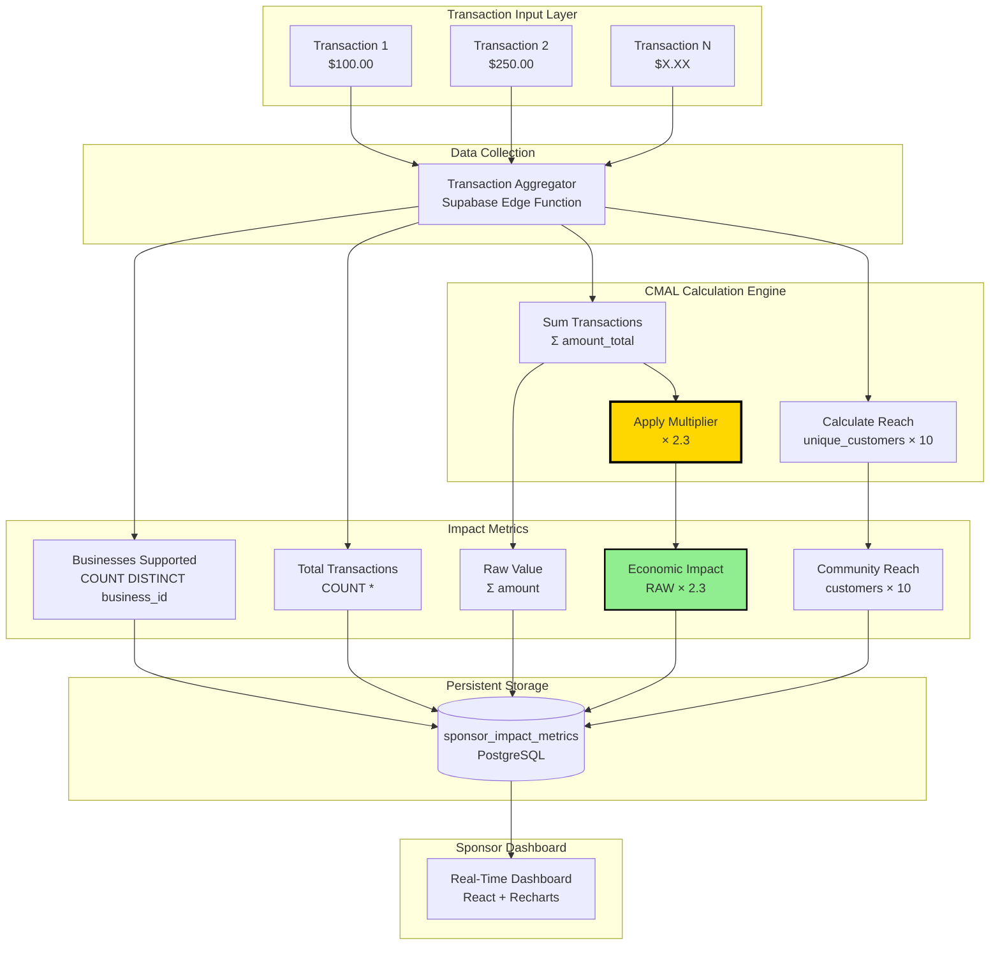
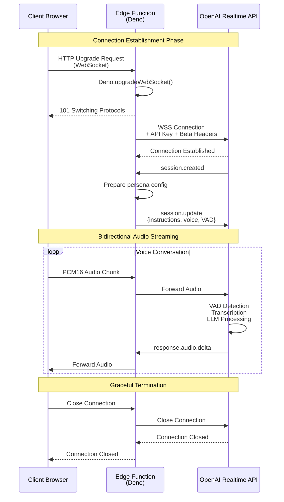
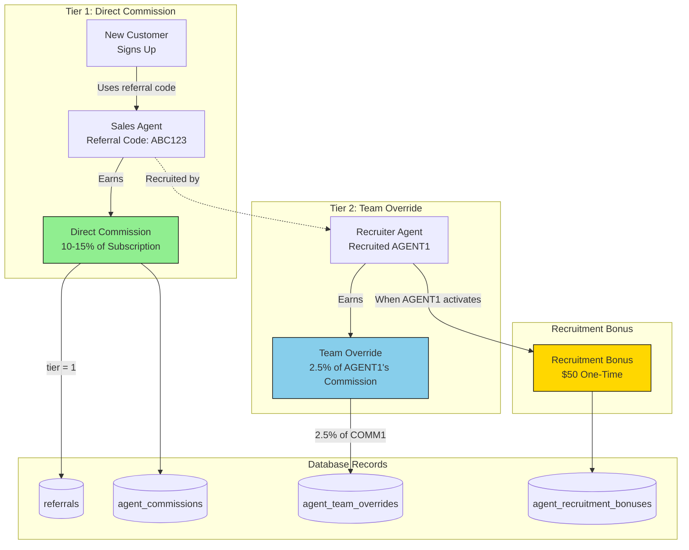
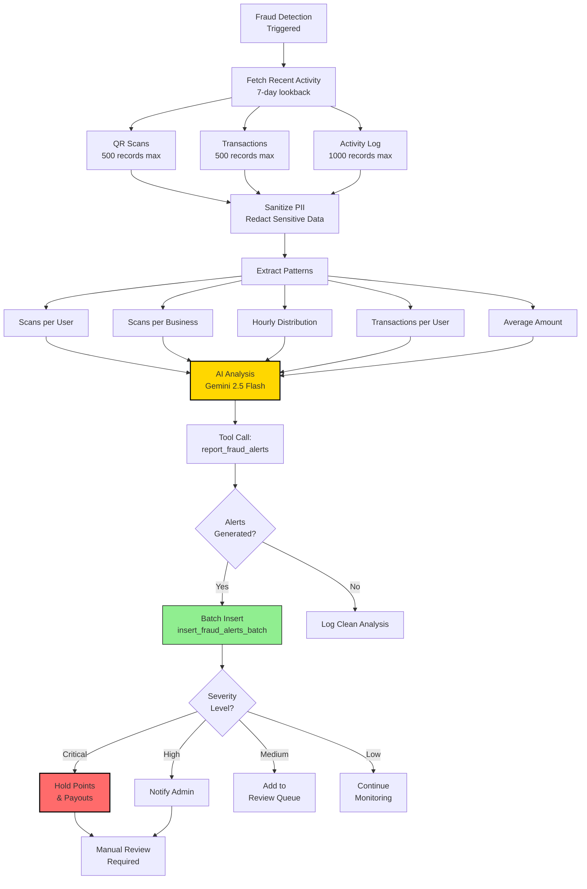
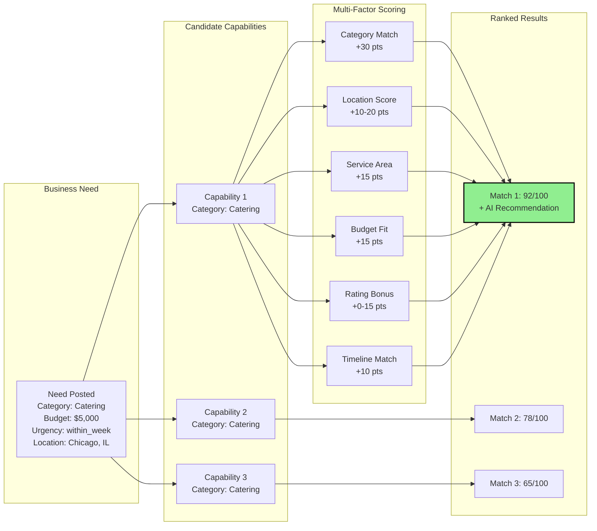
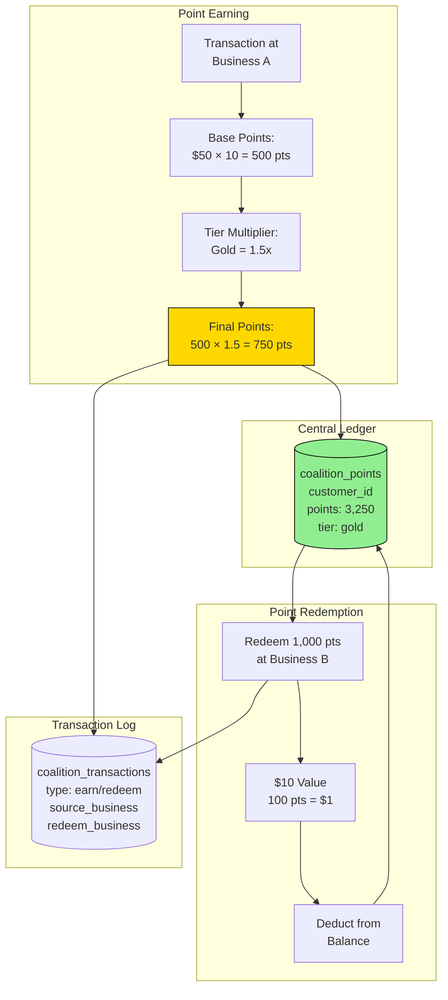
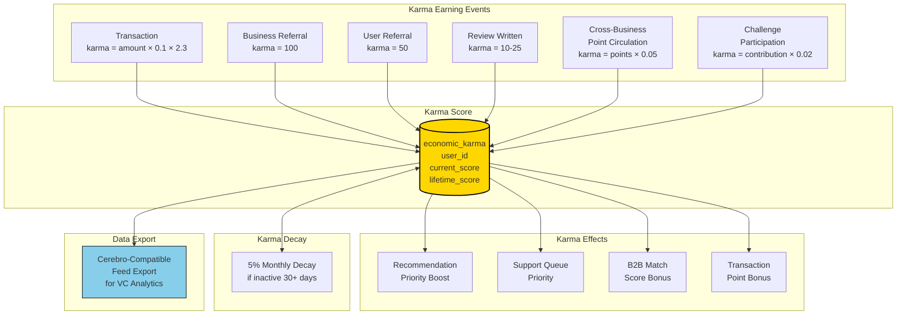

# USPTO SYSTEM ARCHITECTURE DIAGRAMS

## UNITED STATES PATENT AND TRADEMARK OFFICE

---

# System and Method for a Multi-Tenant Vertical Marketplace Operating System

## Technical Specification Diagrams

---

**Filing Date:** January 22, 2026  
**Applicant/Inventor:** Thomas D. Bowling

---

## DIAGRAM 1: CMAL Engine - Economic Circulation Multiplier Data Flow



### CMAL Engine Key Constants

| Constant | Value | Description |
|----------|-------|-------------|
| CIRCULATION_MULTIPLIER | 2.3 | Economic circulation factor |
| REACH_MULTIPLIER | 10 | Community impact per customer |

---

## DIAGRAM 2: Voice AI WebSocket Bridge Architecture



### Voice AI Session Configuration

```json
{
  "type": "session.update",
  "session": {
    "modalities": ["text", "audio"],
    "instructions": "[Persona Instructions - ~2000 chars]",
    "voice": "shimmer",
    "input_audio_format": "pcm16",
    "output_audio_format": "pcm16",
    "input_audio_transcription": {
      "model": "whisper-1"
    },
    "turn_detection": {
      "type": "server_vad",
      "threshold": 0.5,
      "prefix_padding_ms": 300,
      "silence_duration_ms": 800
    },
    "temperature": 0.8
  }
}
```

---

## DIAGRAM 3: Multi-Tier Commission Cascade



### Commission Rate Schedule

| Agent Tier | Lifetime Referrals | Commission Rate | Team Override |
|------------|-------------------|-----------------|---------------|
| Bronze | 0-24 | 10.00% | 2.50% |
| Silver | 25-99 | 12.00% | 2.50% |
| Gold | 100-199 | 13.00% | 2.50% |
| Platinum | 200-499 | 14.00% | 2.50% |
| Diamond | 500+ | 15.00% | 2.50% |

---

## DIAGRAM 4: Fraud Detection Decision Tree



### Velocity Fraud Detection Formula

```
IMPOSSIBLE TRAVEL DETECTION:

V = D / Δt

Where:
  V = Implied velocity (miles per hour)
  D = Haversine distance between scan locations
  Δt = Time delta between scans (hours)

Haversine Formula:
  a = sin²(Δφ/2) + cos(φ₁) × cos(φ₂) × sin²(Δλ/2)
  c = 2 × atan2(√a, √(1-a))
  D = R × c  (where R = 3,959 miles, Earth's radius)

THRESHOLD: V > 600 mph → CRITICAL ALERT

Example:
  Scan 1: NYC (40.7128°N, 74.0060°W) at 10:00 AM
  Scan 2: LA (34.0522°N, 118.2437°W) at 11:30 AM
  
  D = 2,451 miles
  Δt = 1.5 hours
  V = 2,451 / 1.5 = 1,634 mph
  
  1,634 > 600 → CRITICAL: IMPOSSIBLE TRAVEL DETECTED
```

---

## DIAGRAM 5: B2B Matching Scoring Algorithm



### B2B Matching Score Weights

```javascript
const SCORING_WEIGHTS = {
  CATEGORY_MATCH: 30,      // Exact category alignment
  SAME_CITY: 20,           // Identical city location
  SAME_STATE: 10,          // Same state, different city
  SERVICE_AREA_OVERLAP: 15,// Service area includes need
  BUDGET_COMPATIBILITY: 15,// Price within budget
  RATING_BONUS_MAX: 15,    // Scaled by rating (3 pts/star)
  TIMELINE_MATCH: 10,      // Lead time meets urgency
};

const URGENCY_DAYS = {
  immediate: 3,
  within_week: 7,
  within_month: 30,
  planning: 90,
  flexible: 180,
};

// Maximum possible score: 100 (capped)
```

---

## DIAGRAM 6: Coalition Points Flow



### Coalition Tier Benefits

| Tier | Min Points | Multiplier | Benefits |
|------|------------|------------|----------|
| Bronze | 0 | 1.0x | Base earning, coalition access |
| Silver | 1,000 | 1.25x | +25% points, early reward access |
| Gold | 5,000 | 1.5x | +50% points, VIP events, priority |
| Platinum | 15,000 | 2.0x | +100% points, exclusive rewards, concierge |

---

## DIAGRAM 7: QR Transaction Processing

```mermaid
sequenceDiagram
    participant User as Customer
    participant App as Mobile App
    participant Edge as Edge Function
    participant Stripe as Stripe Connect
    participant DB as Supabase DB
    participant Bus as Business Account

    User->>App: Scan QR Code
    App->>Edge: POST /process-qr-transaction<br/>{businessId, amount}
    
    Edge->>Edge: Validate with Zod
    Edge->>DB: Get payment_account<br/>stripe_account_id
    DB-->>Edge: {stripe_account_id,<br/>charges_enabled: true}
    
    Edge->>Edge: Calculate Commission<br/>7.5% = $7.50 on $100
    
    Edge->>Stripe: Create PaymentIntent<br/>amount: $100<br/>application_fee: $7.50<br/>destination: business_stripe_id
    Stripe-->>Edge: {client_secret, id}
    
    Edge->>DB: Insert qr_scans record
    Edge->>DB: Insert transaction record<br/>points_earned: 1000
    Edge->>DB: Record commission
    
    Edge-->>App: {clientSecret, commission}
    
    App->>Stripe: Confirm Payment
    Stripe->>Bus: Transfer $92.50
    Stripe->>Bus: Platform receives $7.50

    style Edge fill:#FFD700,stroke:#000
```

### Commission Split Calculation

```
PLATFORM_COMMISSION_RATE = 7.5%

For $100 transaction:
  amountInCents = 100 × 100 = 10,000 cents
  commission = 10,000 × 0.075 = 750 cents ($7.50)
  businessAmount = 10,000 - 750 = 9,250 cents ($92.50)

Stripe PaymentIntent:
  amount: 10000
  application_fee_amount: 750
  transfer_data.destination: acct_business123
```

---

## DIAGRAM 8: Temporal Founding Member System

```mermaid
flowchart TD
    subgraph Registration["User Registration"]
        REG[User Registers<br/>created_at: 2026-01-15]
    end

    subgraph Trigger["Database Trigger"]
        TRIG[set_founding_member_on_signup<br/>BEFORE INSERT]
        FUNC[set_founding_member_status()]
        CHECK{created_at <<br/>2026-03-31<br/>23:59:59 UTC?}
    end

    subgraph SetStatus["Status Assignment"]
        SET_TRUE[is_founding_member = TRUE<br/>founding_member_since = created_at]
        SET_FALSE[is_founding_member = FALSE<br/>founding_member_since = NULL]
    end

    subgraph Protection["Immutability Protection"]
        PROT[protect_founding_member_status<br/>BEFORE UPDATE]
        REVOKE{Attempting to<br/>revoke status?}
        EXCEPTION[RAISE EXCEPTION<br/>'Cannot be revoked']
        ALLOW[Allow Update]
    end

    subgraph Benefits["Lifetime Benefits"]
        B1[2x Point Multiplier]
        B2[Priority Support]
        B3[Waived Fees]
        B4[Founding Badge]
    end

    REG --> TRIG
    TRIG --> FUNC
    FUNC --> CHECK
    CHECK -->|Yes| SET_TRUE
    CHECK -->|No| SET_FALSE
    
    SET_TRUE --> PROT
    PROT --> REVOKE
    REVOKE -->|Yes| EXCEPTION
    REVOKE -->|No| ALLOW
    
    SET_TRUE --> B1
    SET_TRUE --> B2
    SET_TRUE --> B3
    SET_TRUE --> B4

    style CHECK fill:#FFD700,stroke:#000,stroke-width:2px
    style EXCEPTION fill:#FF6B6B,stroke:#000
    style SET_TRUE fill:#90EE90,stroke:#000
```

### Temporal Cutoff Constant

```sql
-- Immutable temporal boundary
DECLARE
  v_cutoff_timestamp CONSTANT TIMESTAMP WITH TIME ZONE := '2026-03-31T23:59:59Z';
BEGIN
  IF NEW.created_at < v_cutoff_timestamp THEN
    NEW.is_founding_member := true;
    NEW.founding_member_since := NEW.created_at;
  END IF;
  RETURN NEW;
END;
```

---

## DIAGRAM 9: Economic Karma System (NEW)



### Karma Calculation Formulas

```javascript
// Transaction Karma
transaction_karma = transaction_amount × CIRCULATION_MULTIPLIER × 0.1
// Example: $100 × 2.3 × 0.1 = 23 karma

// Referral Karma
business_referral_karma = 100 + (referred_business_tier_bonus × 10)
user_referral_karma = 50 + (referred_user_activity_bonus × 5)

// Review Karma
review_karma = base_karma + (word_count / 50) + (helpfulness_votes × 2)
// Range: 10-25 karma per review

// Cross-Business Circulation Karma (NEW)
circulation_karma = points_used × 0.05
// Rewards using points at different businesses than where earned

// Decay Formula
if (days_since_last_activity > 30) {
  current_karma = current_karma × 0.95; // 5% monthly decay
}
```

---

## END OF SYSTEM DIAGRAMS

---

© 2024-2026 Thomas D. Bowling. All rights reserved.

These technical diagrams are part of the patent specification and are protected intellectual property.
