# USPTO SYSTEM ARCHITECTURE DIAGRAMS — SECOND FILING (CLAIMS 28–40)

## UNITED STATES PATENT AND TRADEMARK OFFICE

---

**PRIVATE & CONFIDENTIAL — DO NOT COPY, FORWARD, OR DISTRIBUTE**
Attorney–Client Work Product. Prepared for: Thomas D. Bowling, Founder & Chief Architect.

---

# System and Method for an Agent-Accessible Vertical Commerce Operating System

## Technical Specification Drawings

---

**Intended Filing Date:** _______________
**Applicant/Inventor:** Thomas D. Bowling
**Companion Documents:** `USPTO_FORMAL_CLAIMS_28-40.md`, `USPTO_PROVISIONAL_SPECIFICATION_28-40.md`

---

## BRIEF DESCRIPTION OF THE DRAWINGS

| Figure | Title | Supports Claim(s) |
|---|---|---|
| FIG. 1 | MCP Discovery Layer — Dual-Tier Authorization Topology | 28, 39 |
| FIG. 2 | Agent-Originated Commerce — Attribution Chain and Decay | 29 |
| FIG. 3 | Hierarchical Agentic Workforce — Delegation and Permission Binding | 30 |
| FIG. 4 | Back-Office Substitution Engine — Cost-Avoidance Accounting | 31 |
| FIG. 5 | Enterprise Tenancy — Organization, Chapter, and Seat Claim | 32 |
| FIG. 6 | Merchant Attribution and Revenue-Share Settlement Rollup | 33 |
| FIG. 7 | Privileged-Column Lock Framework — Before-Update Decision Path | 34 |
| FIG. 8 | Security Autopilot — Scan, Remediate, Verify, Digest Cycle | 35 |
| FIG. 9 | Economic Circulation Graph — Retention, Leakage, Allocation Signal | 40 |

---

## FIG. 1 — MCP Discovery Layer: Dual-Tier Authorization Topology
### (Supports Claim 28 and Claim 39)

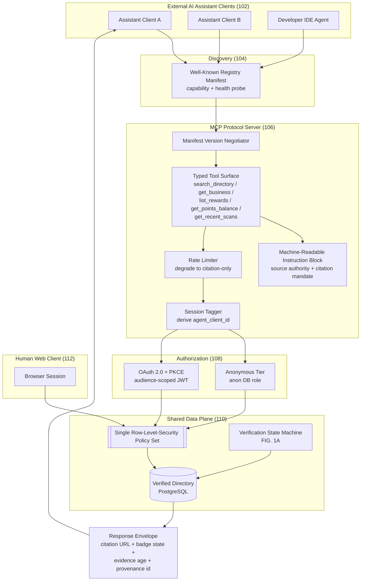

### FIG. 1A — Verification Badge Propagation State Machine (Claim 39)

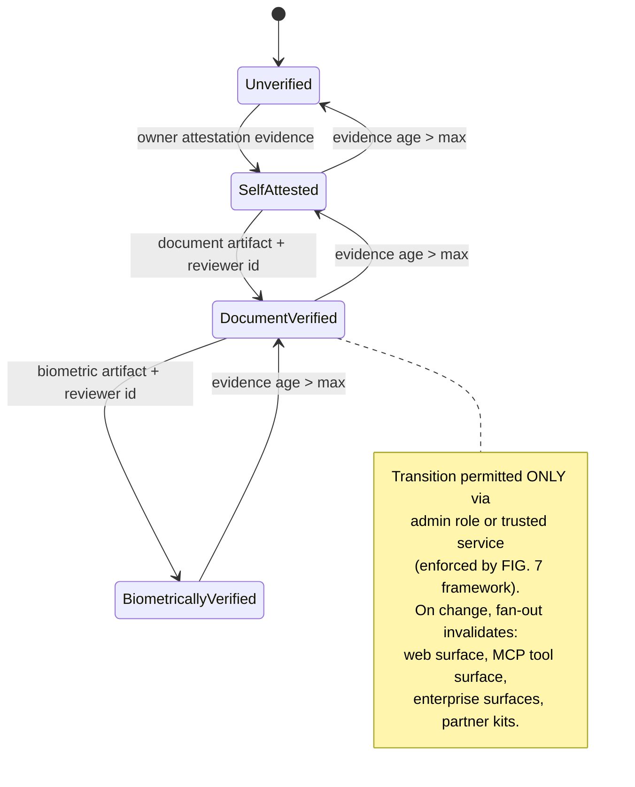

---

## FIG. 2 — Agent-Originated Commerce: Attribution Chain and Decay
### (Supports Claim 29)

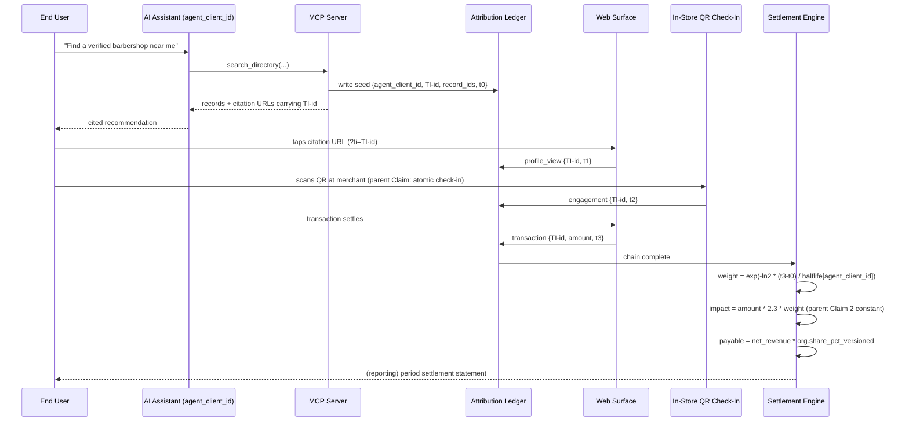

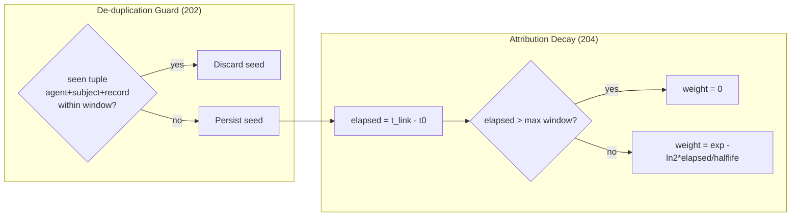

---

## FIG. 3 — Hierarchical Agentic Workforce: Delegation and Permission Binding
### (Supports Claim 30)

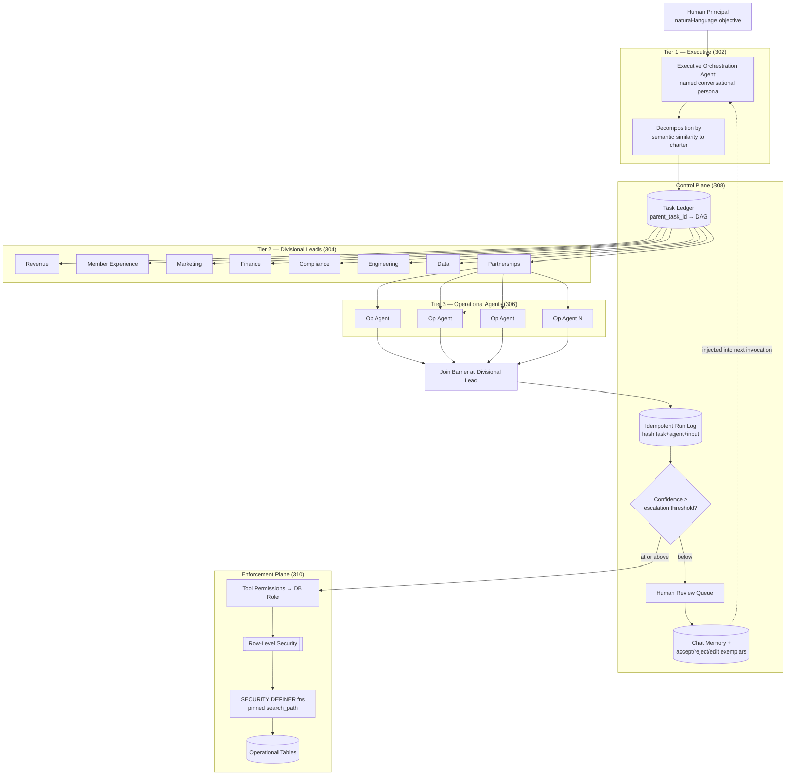

---

## FIG. 4 — Back-Office Substitution Engine: Cost-Avoidance Accounting
### (Supports Claim 31)

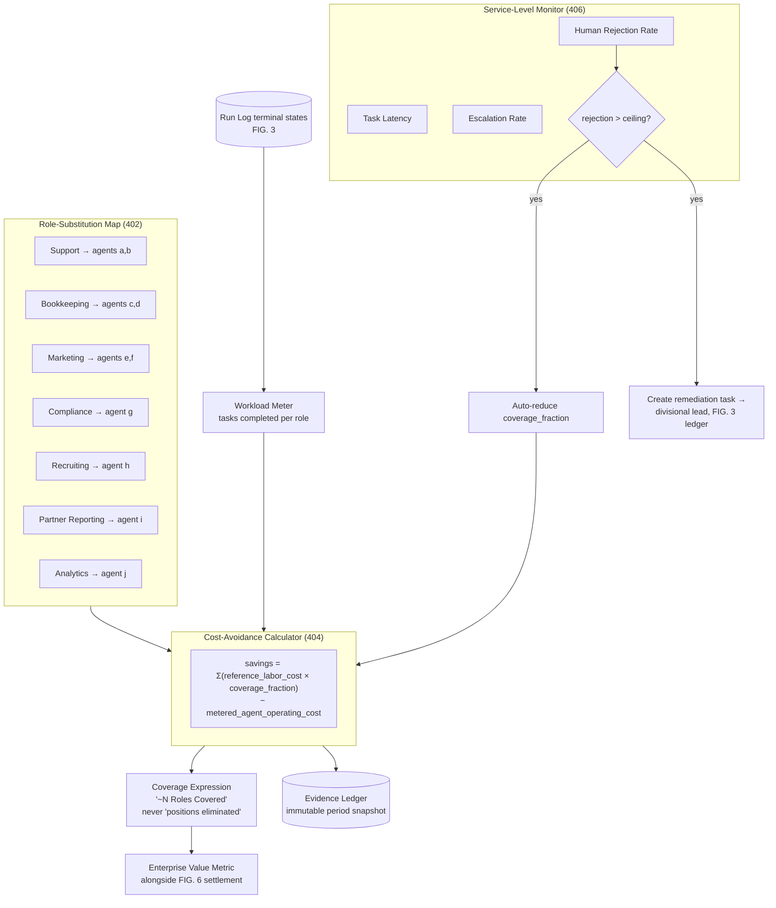

---

## FIG. 5 — Enterprise Tenancy: Organization, Chapter, and Seat Claim
### (Supports Claim 32)

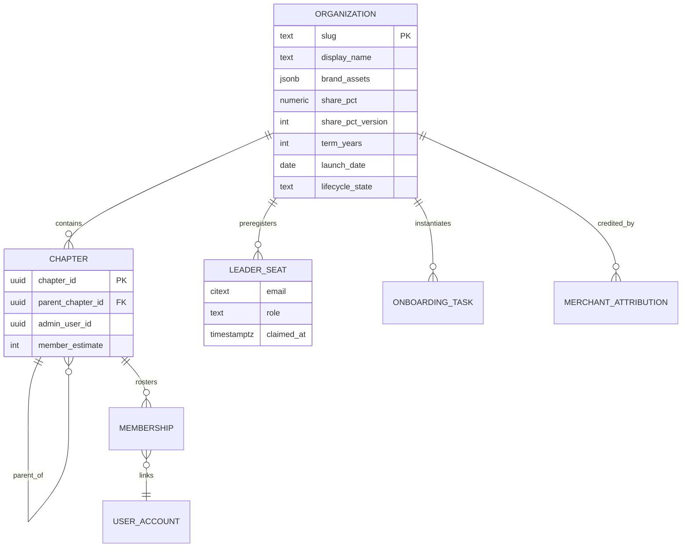

```mermaid
sequenceDiagram
    participant ADM as Org Administrator
    participant SYS as Platform
    participant USR as Future Leader (no account yet)

    ADM->>SYS: pre-register seat (email, chapter, role)
    Note over SYS: seat stored BEFORE account exists
    USR->>SYS: sign up with that email
    SYS->>SYS: claim_enterprise_leader_seats() at first auth
    SYS->>SYS: match authenticated email → pending seat
    SYS->>SYS: atomic grant of scoped role; mark claimed
    SYS-->>USR: co-branded dashboard at /enterprise/{slug}/dashboard
    USR->>SYS: second login (idempotent)
    SYS-->>USR: returns existing grant, no duplicate role
```

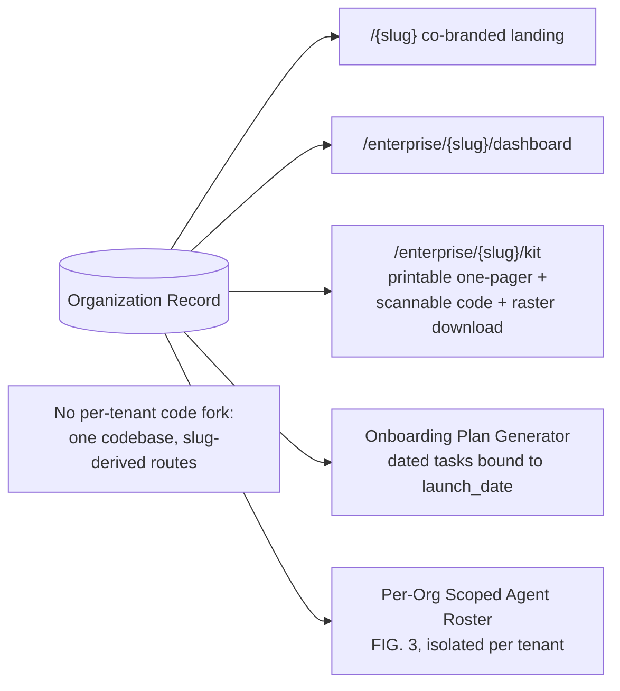

---

## FIG. 6 — Merchant Attribution and Revenue-Share Settlement Rollup
### (Supports Claim 33)

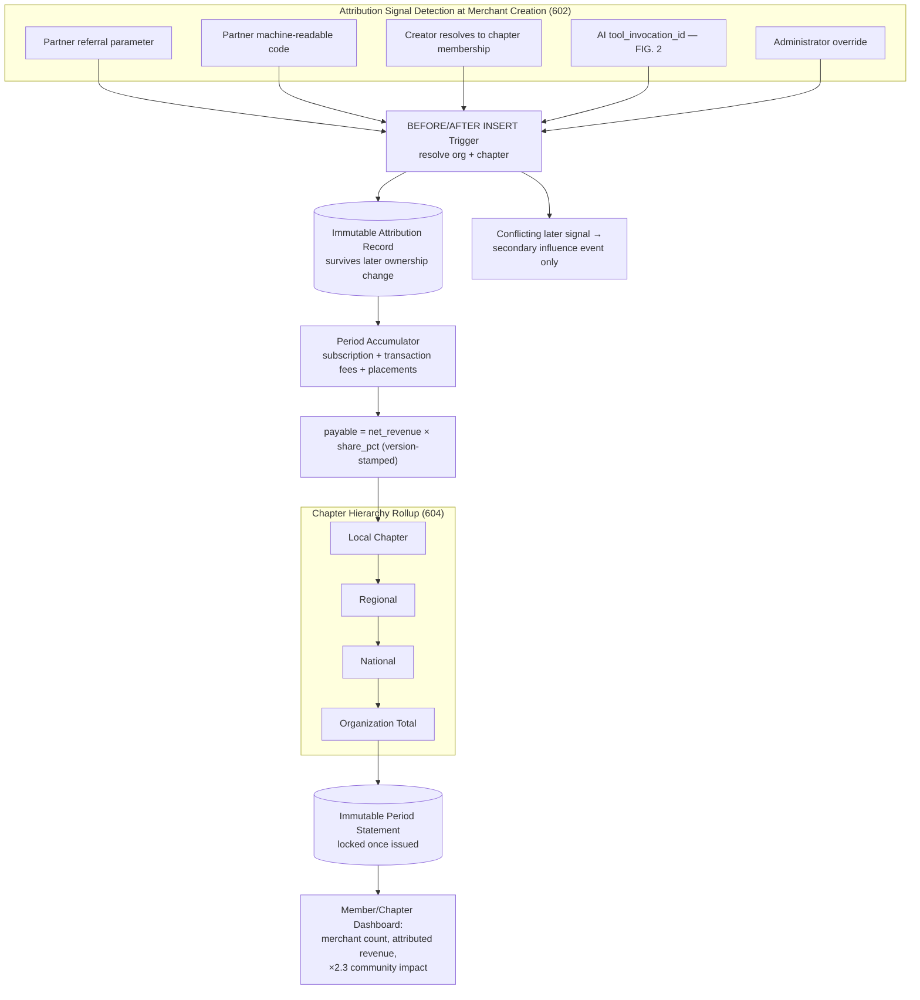

---

## FIG. 7 — Privileged-Column Lock Framework: Before-Update Decision Path
### (Supports Claim 34)

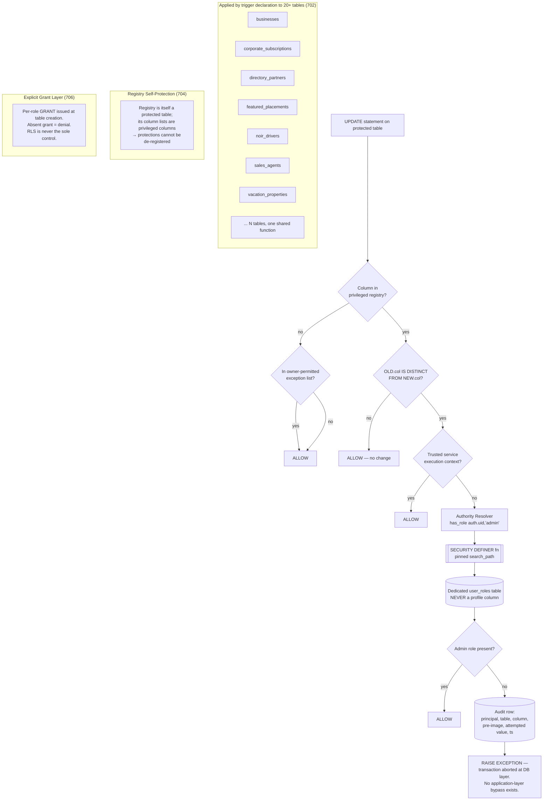

---

## FIG. 8 — Security Autopilot: Scan, Remediate, Verify, Digest Cycle
### (Supports Claim 35)

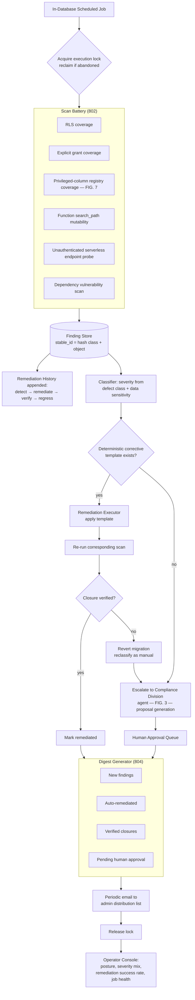

---

## FIG. 9 — Economic Circulation Graph: Retention, Leakage, Allocation Signal
### (Supports Claim 40, incorporating Claims 2, 29, 30, 32, 36)

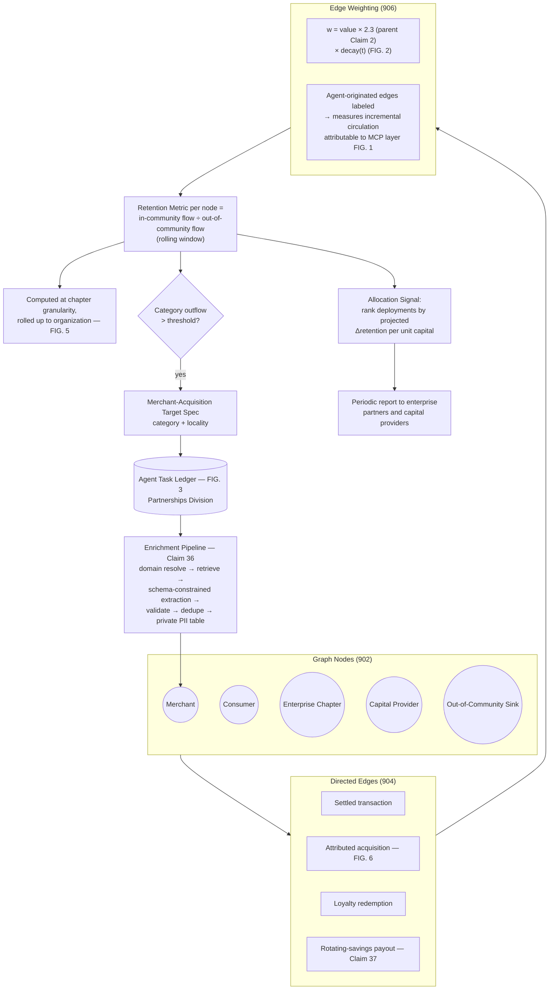

---

## REFERENCE NUMERAL INDEX

| Numeral | Element |
|---|---|
| 102 | External AI assistant clients |
| 104 | Well-known registry manifest / discovery |
| 106 | MCP protocol server |
| 108 | Dual-tier authorization (anonymous / OAuth 2.0 + PKCE) |
| 110 | Shared data plane with single RLS policy set |
| 112 | Human web client |
| 202 | Attribution de-duplication guard |
| 204 | Exponential attribution decay function |
| 302 | Executive orchestration tier |
| 304 | Divisional lead tier |
| 306 | Operational agent tier (42-agent roster) |
| 308 | Control plane (task ledger, run log, confidence, memory) |
| 310 | Enforcement plane (role binding, RLS, definer functions) |
| 402 | Role-substitution mapping table |
| 404 | Cost-avoidance calculator |
| 406 | Service-level monitor with auto coverage reduction |
| 602 | Attribution signal detection at merchant creation |
| 604 | Chapter hierarchy settlement rollup |
| 702 | Shared enforcement function applied across 20+ tables |
| 704 | Registry self-protection |
| 706 | Explicit grant layer |
| 802 | Scan battery |
| 804 | Digest generator |
| 902 | Circulation graph nodes |
| 904 | Circulation graph directed edges |
| 906 | Edge weighting with circulation multiplier and decay |

---

**This document is a technical draft prepared for patent counsel. It is not legal advice.**
